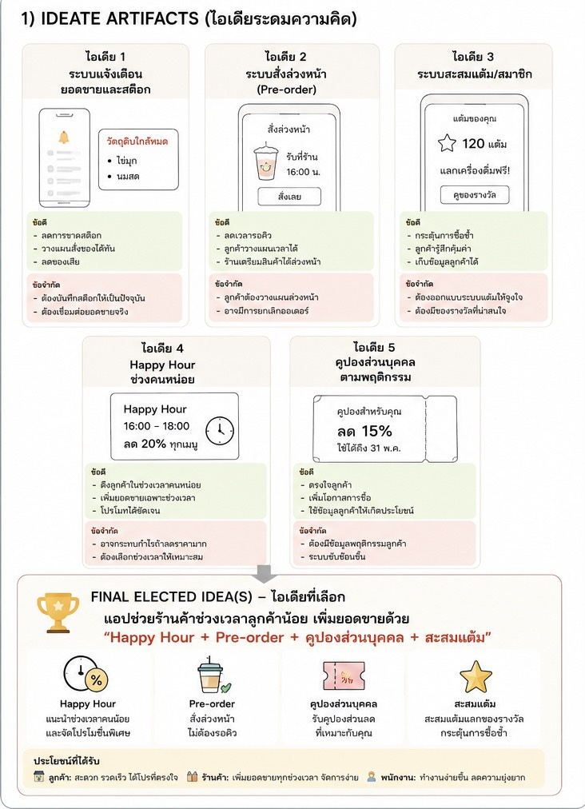
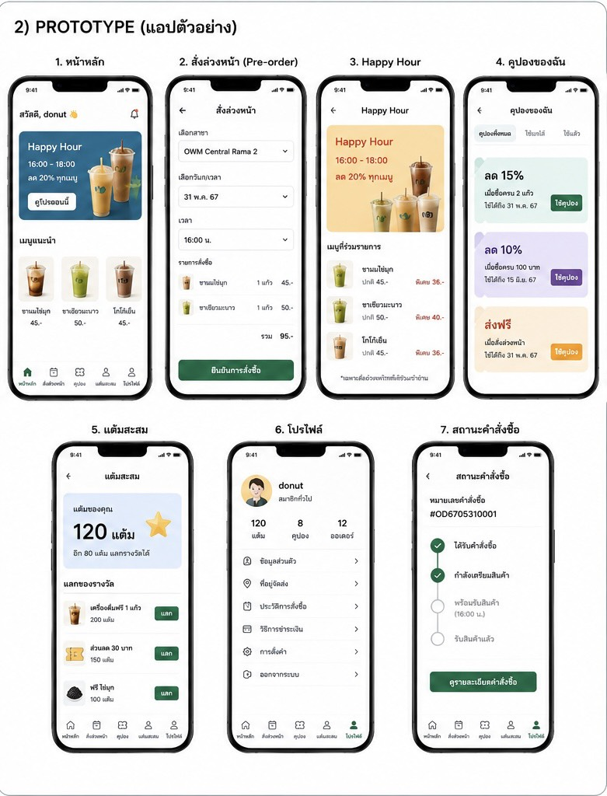

## Ideate

### How Might We (HMW)
เราจะช่วยให้ร้านค้าเพิ่มยอดขาย ดึงดูดลูกค้าในช่วงเวลาที่ลูกค้าน้อย และสร้างการกลับมาซื้อซ้ำของลูกค้าได้อย่างไร?

### Brain Storm
ปัญหา คือบางช่วงลูกค้าน้อย ทำให้ร้านขายของได้น้อยลง

ไอเดียที่คิดไว้
Idea 1: ระบบแจ้งเตือนยอดขาย/วัตถุดิบ
* แจ้งเตือนว่าช่วงไหนลูกค้าน้อยหรือยอดขายตก
* แจ้งเตือนถ้าวัตถุดิบใกล้หมด จะได้เตรียมของทัน

Idea 2: ระบบสั่งล่วงหน้า (Pre-order)
* ลูกค้าสั่งของผ่านแอปได้เลย
* เลือกเวลาที่จะไปรับของได้
* ช่วยลดเวลารอคิวหน้าร้าน

Idea 3: ระบบสะสมแต้ม/สมาชิก
* ซื้อของแล้วได้แต้ม
* เอาแต้มไปแลกส่วนลดหรือของรางวัลได้
* ทำให้ลูกค้าอยากกลับมาซื้ออีก

Idea 4: Happy Hour
* ดูว่าช่วงไหนลูกค้าน้อย
* ทำโปรโมชั่นช่วงนั้น เช่น 16:00–18:00 ลด 20%
* ช่วยดึงลูกค้าเข้าร้านในช่วงที่เงียบ

Idea 5: คูปองส่วนบุคคล
* แจกคูปองตามสิ่งที่ลูกค้าชอบซื้อ
* เช่น ถ้าซื้อชานมบ่อย ก็ให้คูปองลดราคาชานม
* ลูกค้าจะรู้สึกว่าโปรโมชั่นตรงกับตัวเองมากขึ้น

Final Idea — ไอเดียที่เลือก
สุดท้ายเลือกเอา Happy Hour + Pre-order + คูปองส่วนบุคคล + ระบบสะสมแต้ม มารวมกันเป็นแอปเดียว
เพราะคิดว่าน่าจะช่วยแก้ปัญหาลูกค้าน้อยในช่วงเวลาที่เงียบได้ดี แล้วก็ช่วยให้ลูกค้ามีเหตุผลที่จะกลับมาซื้ออีก ส่วนร้านก็มีโอกาสเพิ่มยอดขายได้มากขึ้น

### Prototype
ชื่อแนวคิด: แอปช่วยเพิ่มยอดขายช่วงที่ลูกค้าน้อย
อ้างอิง

หน้าต่าง ๆ ในแอป
1. Home - หน้าแรก เอาไว้ดูโปรโมชั่นต่าง ๆ
2. Pre-order - เลือกเมนูที่อยากได้ แล้วเลือกเวลาที่จะไปรับ
3. Happy Hour - ดูว่าช่วงไหนมีโปรลดราคา
4. คูปองของฉัน - รวมคูปองที่มี สามารถกดใช้ตอนสั่งซื้อได้
5. แต้มสะสม - เช็กแต้มที่มี และเอาแต้มไปแลกส่วนลดหรือของรางวัล
6. Profile - ดูข้อมูลตัวเองกับประวัติการสั่งซื้อ
7. สถานะคำสั่งซื้อ - เช็กว่าสั่งถึงขั้นตอนไหนแล้ว และพร้อมให้ไปรับหรือยั
---
### รูปภาพประกอบ Prototype

